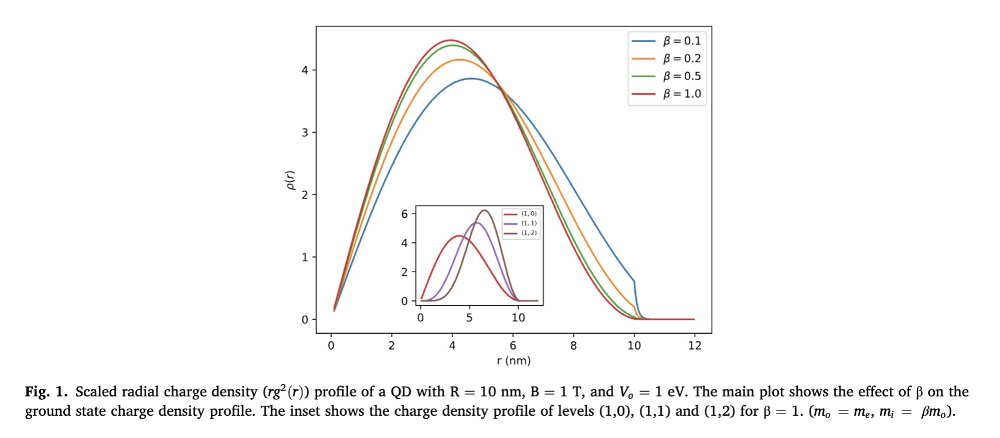

# BDD-paper-code

This repository containes codes used for my paper (in collaboration with Sayak Biswas and Shivam Handa) titled: "Landau quantization of a circular quantum dot using the BenDaniel-Duke boundary condition" published in _Superlattices and Microstructures_ in 2020. Journal link: [https://www.sciencedirect.com/science/article/abs/pii/S0749603620312428](https://www.sciencedirect.com/science/article/abs/pii/S0749603620312428)

For the charge density plot above, I've created a separate notebook going through the computation step-by-step. For the other plots you will find in the paper, just run the corresponding `.py` file as `python file.py` in terminal or option+shift+enter in VS code.

I've also provided a PDF copy of the published version for those unable to access the PDF via the journal link.